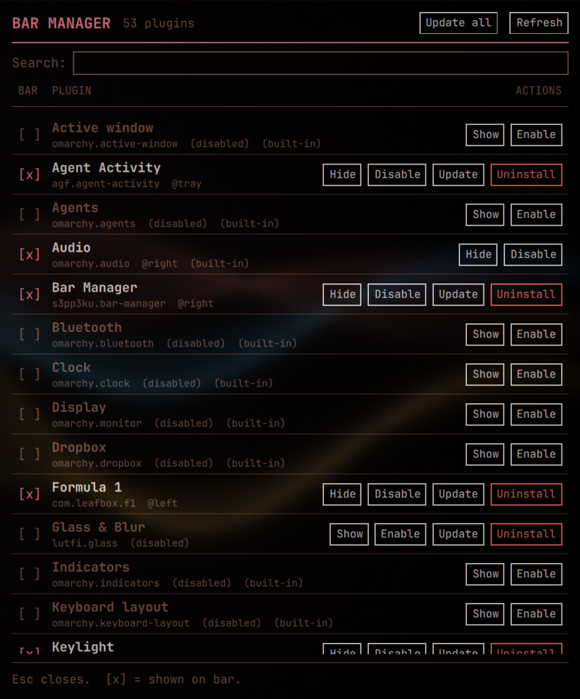

# Omarchy Bar Manager



One panel to control which plugins appear in your [Omarchy](https://omarchy.org) bar, so you don't have to hand-edit `shell.json` or run a string of `omarchy plugin ...` commands every time you want to change something.

For every bar plugin you get:

| Action | What it does |
|---|---|
| **Hide / Show** | Take a widget off the bar but **keep it installed and enabled**, then put it back in the same spot later. |
| **Enable / Disable** | Turn a plugin on or off. |
| **Update** | Update a git-installed plugin (or **Update all** from the header). |
| **Uninstall** | Remove a plugin entirely. Needs a second click to confirm. |

Built-in Omarchy plugins can be hidden, shown, enabled and disabled; update and uninstall are only offered for plugins you installed.

## Why

Omarchy's CLI can enable, disable and remove plugins, but has no "take it off the bar, but keep it" command, and widgets can live in different places (a bar section, or hosted inside a tray plugin). This tool handles both, shows what is actually on your bar right now, and does it from a clickable list.

## Features

- **Live status** for every bar widget: `[x]` on the bar (and which section, or `@tray`), `[ ]` not on it, plus enabled/disabled and built-in markers.
- **Hide without uninstalling**, with the original position remembered so **Show** restores it.
- **Smart search**: finds plugins by name, id, category, aliases and description, understands everyday words (`sound` finds Audio, `wifi` finds Network, `cpu` finds System monitor) and tolerates small typos (`blutooth`).
- **Duplicate cleanup**: removes repeated tray entries that cause doubled icons, automatically on every change (or `barctl fix`).
- **Safe edits**: before every change to `shell.json` a backup is saved as `shell.json.bak.barctl-<timestamp>` (last five are kept).
- **Theme-aware**: simple flat, monospace look that follows your current Omarchy theme colors.
- **Scriptable**: everything the panel does is available from the terminal via `bin/barctl`.

## Requirements

- Omarchy with the shell plugin system (`omarchy plugin`, `omarchy-shell`)
- `jq`

## Install

```sh
omarchy plugin add https://github.com/s3pp3ku/omarchy-bar-manager.git --enable --yes
```

Enabling it adds a small sliders icon to the right side of your bar. Click it to open the manager, or bind a key:

```sh
omarchy-shell shell toggle s3pp3ku.bar-manager '{}'
```

Press **Esc** to close the panel.

To remove it:

```sh
omarchy plugin remove s3pp3ku.bar-manager --yes
```

## Command line

```sh
bin/barctl list                  # JSON of every bar widget and its state
bin/barctl hide <plugin-id>      # off the bar, still installed
bin/barctl show <plugin-id>      # back on the bar where it was
bin/barctl enable <plugin-id>
bin/barctl disable <plugin-id>   # also takes it off the bar
bin/barctl update <plugin-id>    # or: update --all
bin/barctl uninstall <plugin-id>
bin/barctl fix                   # drop duplicate tray entries
```

Use `OMARCHY_SHELL_JSON=/path/to/copy.json` to try changes against a copy of your config instead of the real one.

## How it works

`barctl` is a small bash + `jq` script over the real Omarchy commands and `~/.config/omarchy/shell.json`. Top-level bar widgets are removed from `bar.layout`; widgets hosted inside a tray plugin are removed from that tray's widget list. Where each hidden widget lived is stored in `~/.local/state/barctl-hidden.json` so **Show** can put it back. The panel (`Panel.qml`) is only a front end that calls `barctl`.

## Notes

- The compositor may size the window narrower than requested; the layout is built for roughly 560px and up.
- Tested on Omarchy with a tray plugin hosting several widgets; layouts with other container plugins may behave differently. Issues and pull requests welcome.

## License

MIT
